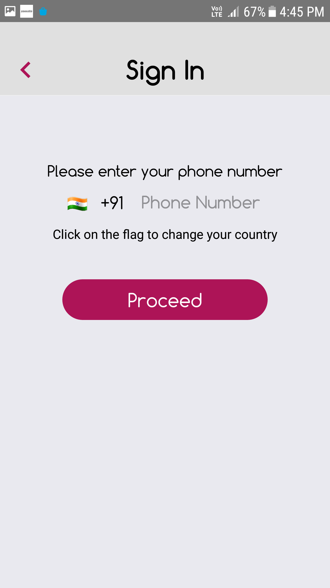

# Synopsis

Flambr is a dating app, developed using React Native and Firebase. It is currently designed to run only on android. I took heavy inspiration from Tinder. As such, the app contains the features such as swipe to like/ignore and chatting. I used Firebase for my backend, since it was the fastest option available. I have created the app myself and used only open source librares for react native. I am putting in some snapshots of the app. To run the app, first clone repository. Run `yarn install` to install all the dependencies. The run `yarn android` to run the app. Make sure that an android device is connected to your system and that remote debugging is turned on. Images: 

